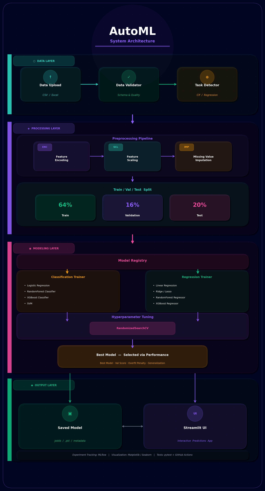
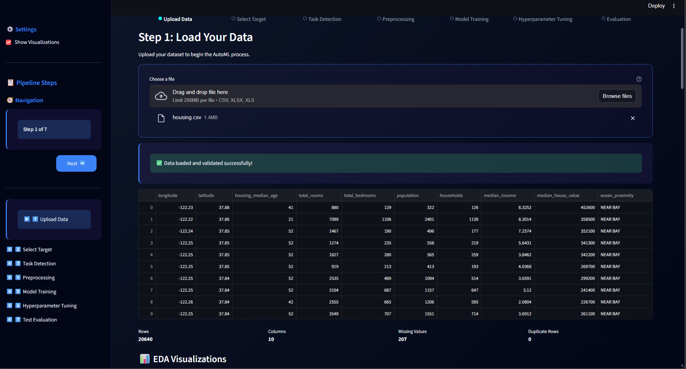
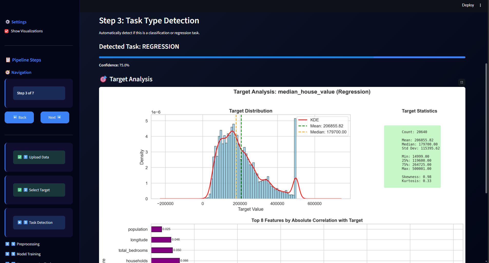
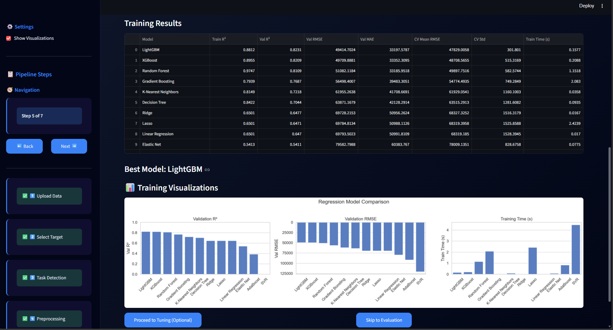
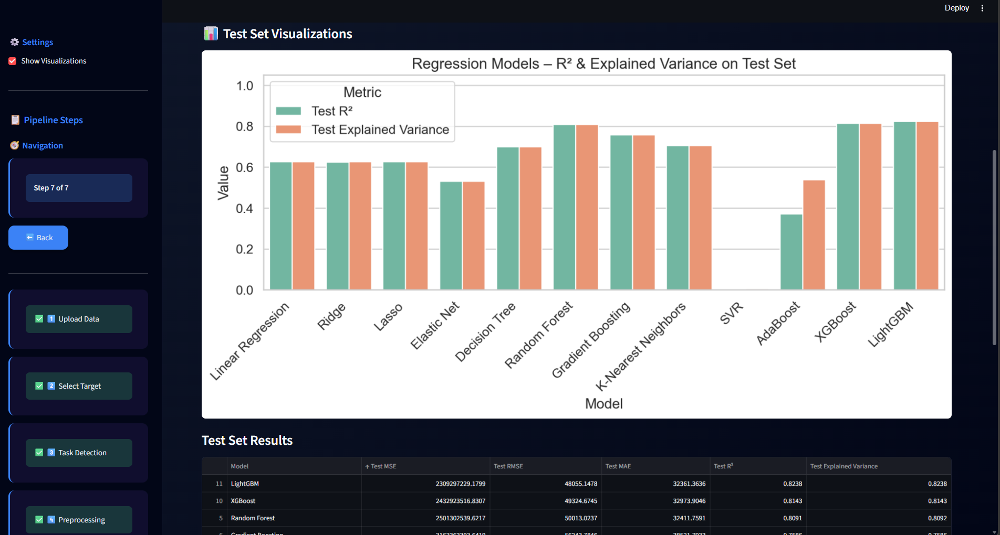

<p align="center">
  
</p>

<p align="center">
  <a href="https://github.com/mohanadcv/AutoML/actions/workflows/tests.yml">
    
  </a>
<p align="center">
  
  
  
  
  
  
  
  
  
  
</p>

---

## What Is This?

**AutoML System** is a complete, production-grade machine learning mini framework that automates the entire ML workflow, from messy raw data to a downloadable, deployable model with zero manual coding required from the end user.

It solves a real problem: building an ML model correctly requires 200+ lines of boilerplate, expert knowledge of preprocessing, algorithm selection, and hyperparameter tuning. AutoML collapses all of that into a guided 8-step wizard, or a single CLI command for developers.

> Built from scratch. No AutoML wrapper libraries. Every component is hand-engineered.

---

## Features

| Capability | Details                                                                                             |
|---|-----------------------------------------------------------------------------------------------------|
| 🔄 **End-to-End Pipeline** | Raw data → preprocessing → training → tuning → deployment                                           |
| 🧠 **Auto Task Detection** | 6-rule heuristic voting system detects classification vs regression with confidence score           |
| ⚙️ **Auto Preprocessing** | Smart encoding (one-hot for low-cardinality, frequency for high), StandardScaler, median imputation |
| 📊 **10+ Algorithms** | Random Forest, XGBoost, LightGBM, Logistic Regression, Ridge, Lasso, SVM, KNN, GBM, AdaBoost        |
| 🔧 **Hyperparameter Tuning** | RandomizedSearchCV with per-model parameter grids, configurable iterations                          |
| 📈 **Rich Visualizations** | Auto EDA, training comparisons, tuning results, confusion matrices, residual plots                  |
| 🖥️ **Dual Interface** | Streamlit UI for business users + full CLI with argparse for developers                             |
| 📝 **Experiment Tracking** | MLflow integration — every run logged automatically                                                 |
| ✅ **Test Suite** | Unit + integration tests mirroring src structure, CI via GitHub Actions                             |
| 💾 **Model Persistence** | Saves model package (model + scaler + feature names + metadata) as `.pkl`                           |
| 🔮 **Live Predictions** | Upload unlabeled new data → get predictions downloaded as CSV or Excel instantly                    | |
| 🔒 **Privacy-First Design** | User data processed in-memory only — never written to disk, gone after session                      |

---

## 🏗️ Architecture

<p align="center">
  
</p>

The system is organized into 4 independent layers, each with a single responsibility:

**DATA LAYER** — Loads CSV/Excel, validates schema and quality, detects task type automatically.

**PROCESSING LAYER** — Applies a fit/transform preprocessing pipeline (encoding → scaling → imputation), then performs a 64/16/20 train/val/test split.

**MODELING LAYER** — The Model Registry dispatches to Classification or Regression Trainer. Models are trained in parallel, then optimized with RandomizedSearchCV. Best model is selected by validation score with an overfit penalty.

**OUTPUT LAYER** — Saves the model package to disk and serves it through the Streamlit prediction UI.

---

## 🖥️ UI Walkthrough

| Step | What Happens |
|------|-------------|
| **1. Upload Data** | Drag & drop CSV/Excel → instant validation + quality dashboard |
| **2. Select Target** | Column picker with stats preview |
| **3. Task Detection** | Auto-detects classification vs regression with confidence % |
| **4. Model Training** | Select models, compare results, visualize performance |
| **5. Evaluate & Deploy** | Test set results, download model, make predictions |

<table>
  <tr>
    <td align="center" width="50%">
      
      <br/><sub><b>Data Upload & EDA</b></sub>
    </td>
    <td align="center" width="50%">
      
      <br/><sub><b>Target Analysis Dashboard</b></sub>
    </td>
  </tr>
  <tr>
    <td align="center" width="50%">
      
      <br/><sub><b>Model Comparison & Training Results</b></sub>
    </td>
    <td align="center" width="50%">
      
      <br/><sub><b>Test Evaluation & Deployment</b></sub>
    </td>
  </tr>
</table>

## 🎥 Live Demo


**Watch the 8-step workflow in action:**

| Quick Preview Data Uploading and Preprocessing |
|:----------------------------------------------:|
|                      |


**[📺 Watch the full demo on LinkedIn](https://linkedin.com/your-post)**

## Quick Start

**Prerequisites:** Python 3.12+, [uv](https://github.com/astral-sh/uv)

```bash
# 1. Clone the repository
git clone https://github.com/mohanadcv/AutoML.git
cd AutoML

# 2. Install all dependencies (reads pyproject.toml)
uv sync

# 3a. Launch the interactive UI
streamlit run app.py

# 3b. OR run the CLI pipeline
python main_pipeline.py --data your_data.csv --target your_target_column
```

---

## CLI Reference

The pipeline exposes a full argparse interface for developers and scripting:

```bash
# Full pipeline — auto-detect task, train all models, tune, evaluate, save
python main_pipeline.py --data data.csv --target price --models all

# Train specific models only
python main_pipeline.py --data data.csv --target survived \
  --models "Random Forest,XGBoost,LightGBM"

# Force task type (override auto-detection)
python main_pipeline.py --data data.csv --target target \
  --task-type classification

# Preprocessing only — inspect transformed features before training
python main_pipeline.py --data data.csv --target price --preprocess-only

# Train without hyperparameter tuning (faster baseline)
python main_pipeline.py --data data.csv --target price --no-tune

# Train only — skip tuning and evaluation
python main_pipeline.py --data data.csv --target price --train-only

# Custom tuning iterations and output path
python main_pipeline.py --data data.csv --target price \
  --n-iter 50 --output models/my_model.pkl

# Disable visualizations (useful for headless servers / CI)
python main_pipeline.py --data data.csv --target price --no-viz

# Full help
python main_pipeline.py --help
```

---

## Streamlit UI — 8-Step Wizard

| Step | What Happens                                                                           |
|---|----------------------------------------------------------------------------------------|
| **1. Upload Data** | Drag & drop CSV/Excel → instant validation + EDA visualizations                        |
| **2. Select Target** | Dropdown with column stats preview (dtype, unique count, distribution)                 |
| **3. Task Detection** | System detects classification/regression with confidence % — user can override         |
| **4. Preprocessing** | One click runs the full pipeline — summary shows encoded/scaled feature counts         |
| **5. Model Training** | Select models (or "all"), toggle cross-validation, view comparison table               |
| **6. Hyperparameter Tuning** | Optional — select models to tune, set iteration count                                  |
| **7. Evaluate & Deploy** | Test set results, download model `.pkl`, upload new data/inputs → download predictions |

---

## Project Structure

```
AutoML/
│
├── 🔧 .github/
│   └── workflows/
│       └── tests.yml                       # CI: auto-runs full test suite on every push/PR
│
├── ⚙️ Config/
│   └── config.py                           # Central configurations: paths, ReprducibilIty settings
│
├── 📦 src/
│   │
│   ├── 🗄️ data_processing/                 # Everything that touches raw data
│   │   ├── loader.py                       # Reads CSV & Excel, handles Streamlit uploads
│   │   ├── validator.py                    # Schema checks, null thresholds, min-sample guards
│   │   ├── task_detector.py                # 6-rule heuristic classifier: clf vs regression + confidence
│   │   ├── preprocessing_pipeline.py       # Fit/transform: encoding + scaling + imputation
│   │   └── splitting.py                    # Stratified train/val/test split
│   │
│   ├── 🤖 models/                          # All ML logic lives here
│   │   ├── registry.py                     # Model catalog — single source of truth for all algorithms
│   │   ├── trainers/
│   │   │   ├── classification.py           # Trains & evaluates classification models, computes metrics
│   │   │   └── regression.py               # Trains & evaluates regression models, computes metrics
│   │   ├── hyperparameter_tuning_setup.py  # RandomizedSearchCV with per-model param grids
│   │   └── final_evaluation.py             # Test-set evaluation, plots confusion matrix / residuals
│   │
│   ├── 📈 visualizations/                  # All matplotlib/seaborn plots
│   │   ├── eda.py                          # EDA: distributions, correlations, quality check, target analysis
│   │   ├── training.py                     # Model comparison bar charts after training
│   │   └── tuning.py                       # Before/after tuning performance comparisons
│   │
│   └── 🛠️ utils/
│       └── mlflow_setup.py                 # MLflow experiment init, run logging, artifact tracking
│
├── 🧪 tests/                               # Mirror of src/ — every module has a test file
│   ├── conftest.py                         # Shared fixtures: sample DataFrames, mock configs
│   ├── test_data_processing/
│   │   ├── test_loader.py                  # CSV/Excel loading, encoding detection
│   │   ├── test_validator.py               # Edge cases: empty files, missing targets, bad dtypes
│   │   ├── test_eda.py                     # Plot generation doesn't crash on various data shapes
│   │   ├── test_task_detector.py           # All 6 detection rules + confidence scoring
│   │   └── test_splitting.py               # Correct split ratios, stratification check
│   ├── test_models/
│   │   ├── test_registry.py                # Model lookup, task filtering, default model list
│   │   ├── test_classification_trainer.py  # Train/predict/metric correctness
│   │   ├── test_regression_trainer.py      # R², RMSE, MAE sanity checks
│   │   ├── test_tuning.py                  # RandomizedSearchCV finds param improvements
│   │   └── test_final_evaluation.py        # Test-set evaluation + plot generation
│   ├── test_preprocessing/
│   │   └── test_pipeline.py                # Fit/transform consistency, no data leakage
│   └── test_visualization/
│       ├── test_training_visualizer.py     # Plots return valid Figure objects
│       └── test_tuning_visualizer.py       # Tuning comparison plots render correctly
│
├── 🗂️ assets/
│   ├── images/                             # UI screenshots & banner
│   │   ├── architecture_diagram.png        # System diagram
│   │   ├── banner.png
│   │   ├── upload.png                      
│   │   ├── target.png
│   │   ├── training.png
│   │   └── evaluation.png                  
│   └── demo/                               # End-to-end workflow demo
│       ├── steps_1_to_4.webm
│       ├── steps_5_&_6.webm
│       └── steps_7_&_8.webm                
│
├── 🖥️ app.py                               # Streamlit entry point — 8-step guided UI
├── 🚀 main_pipeline.py                     # CLI entry point — full argparse interface
├── 📋 pyproject.toml                       # Project metadata + all dependencies (uv sync)
├── 🧪 pytest.ini                           # Pytest config: test paths, markers, verbosity
├── 🚫 .gitignore  
├── 💠 LEARNINGS.md                
└── 📖 README.md
```

## Tech Stack

<p align="center">
  
  
  
  
  
  
  
  
  
  
</p>

---

## Design Principles

This project was built with production software engineering in mind, not just notebook-style scripts.

**SOLID Architecture** — each class has one job. `DataLoader` loads, `DataValidator` validates, `TaskDetector` detects. They don't overlap.

**Factory Pattern** — `ModelRegistry` acts as a factory. Callers request a model by name and task type; the registry instantiates and returns it. Adding a new algorithm requires changing exactly one file.

**Pipeline Pattern** — `PreprocessingPipeline` implements `fit_transform` / `transform` — the same scikit-learn contract. Training data fits the pipeline; test data only transforms. No leakage.

**Strategy Pattern** — `ClassificationTrainer` and `RegressionTrainer` share the same interface. `AutoMLPipeline` picks which strategy to use based on detected task type.

**Dependency Injection** — `Config` is injected into every component. Changing a hyperparameter, path, or random seed in one place propagates everywhere.

**Stateless & Privacy-First** — uploaded data is never saved to disk. Files are
read directly into memory via pandas, processed, and garbage-collected when the
session ends. No cleanup jobs, no GDPR headache, no disk space issues. The only
thing persisted is the trained model `.pkl` — which contains zero user data.

> **Note on feature engineering:** The pipeline intentionally excludes domain-specific feature engineering (e.g., interaction terms). These decisions require domain knowledge and are left to the user, the system handles everything that can be automated safely across any dataset.

---

## 🧠 Engineering Learnings

Building this system required solving real engineering problems — from data type edge cases and overfit-aware model selection to stateless UI architecture and production-safe serialization. Every challenge below came from something that actually broke.

**[→ Read the full technical breakdown in LEARNINGS.md](LEARNINGS.md)**

---

## Roadmap

- [ ] SHAP value explanations per prediction
- [ ] REST API endpoint (FastAPI) for programmatic inference
- [ ] Docker + docker-compose for one-command deployment
- [ ] Deep Learning support (PyTorch tabular)
- [ ] Automated outlier detection in preprocessing
- [ ] Time series task detection and modeling

---
### ✍️ Author

**Mohanad Ahmed (Mo. A)**

🔗LinkedIn: [https://www.linkedin.com/in/mohanad-ahmed01](https://www.linkedin.com/in/mohanad-ahmed01e)

🔗Github: [https://github.com/mohanadcv](https://github.com/mohanadcv)

---
## License

MIT ©

---

<p align="center">
  <sub>Open-source AutoML framework · Modular End-to-End ML Pipeline · Auto Task Detection · Auto Preprocessing · Hyperparameter Tuning · Model Tracking & Evaluation · MLflow Experiment Tracking · CLI & Streamlit UI</sub>
</p>